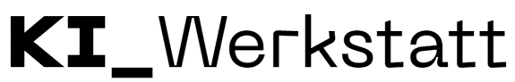

 

# Canvas für Gen-AI-Projekte
Nutzen Sie die Vorlagen in diesem Repository, um Ihre Gen-AI-Projekte
- als erste Idee initial zu formulieren (Ideation Canvas),
- detailliert auszuarbeiten und besprechbar zu machen (Project Canvas),
- gegeneinander abzuwägen und Potenzial zu bewerten (Scoring).

## Mehr Infos
Details zu Projekten und Kontaktmöglichkeiten finden sich auf der Seite der [KI Werkstatt](https://kiwerkstatt.f2.htw-berlin.de/).

## Lizenz
Die vorliegenden Inhalte sind frei verfügbar unter einer CC BY-SA 4.0 Lizenz.
